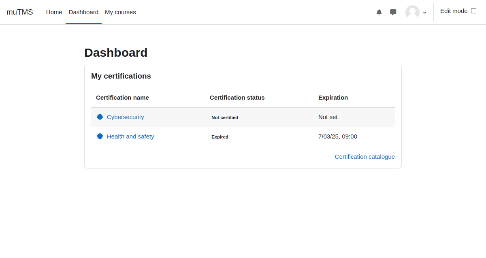

[Certifications documentation](index.md) / My certification block

# My certifications block

The _My Certifications_ block allows users to easily stay informed about their assigned certifications
directly from their dashboard. By adding this block, users can quickly view all their allocated certifications,
helping them track their compliance status.

  
