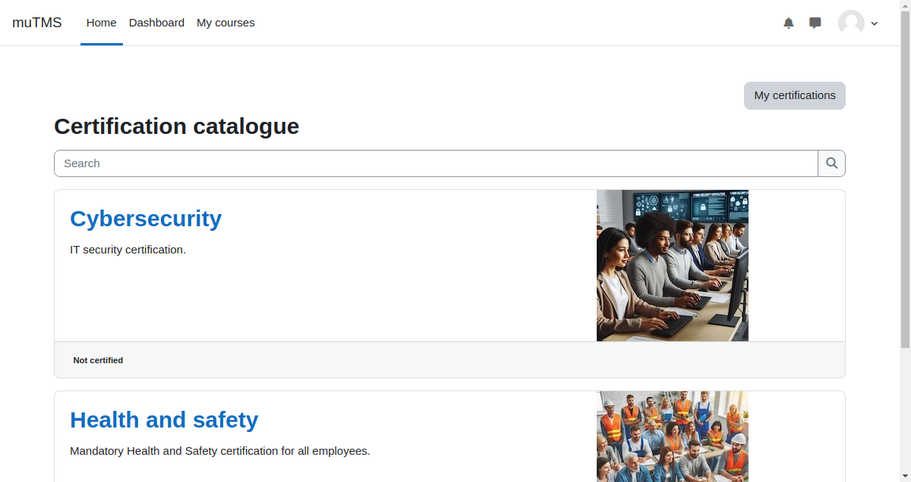

[Certification documentation](index.md) / Certification catalogue

# Certification catalogue

The Certification catalogue serves as a central platform where students can explore and interact with available certifications.
It supports multiple allocation sources, providing flexibility in how users are assigned to certifications.

The Certification catalogue can be accessed from users' [My certifications profile page](profile_my_certifications.md), making it an
integrated part of the user experience.

Certification visibility in the catalogue is managed through the [Certification management interface](management_certification_visibility.md).
Please note that archived certifications are not visible in the catalogue. The catalogue always adheres to tenant separation rules.  

