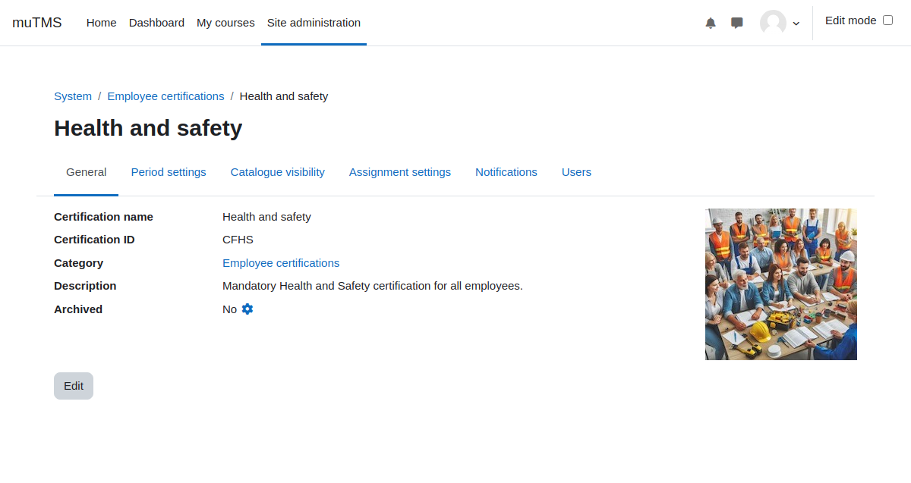

[Certifications documentation](index.md) / [Certification management](management_index.md) / Certification settings 

# Certification settings

Certifications, like programs, are identified by their names and unique ID numbers. They can be created either
at the system context level or within a specific category context.

Entire certifications or individual user assignments can be set to an archived status. Archiving pauses user progress
in associated programs and makes the certification invisible to regular users.

