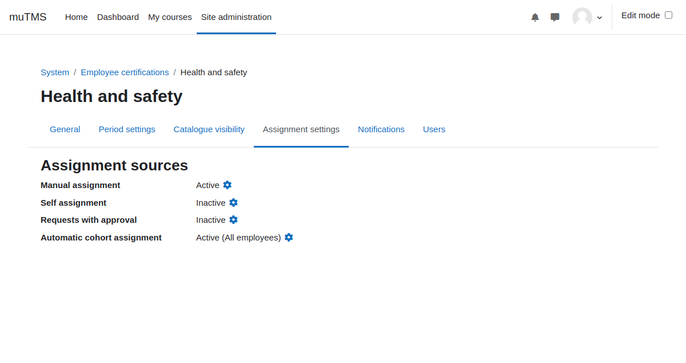

[Certifications documentation](index.md) / [Certification management](management_index.md) / Certification assignment settings

# Certification assignment settings

Students may be assigned to certifications through the following sources:

- **Manual assignment**: A manager with the _Assign users to certifications_ capability in certification context may manually assign users.
- **Self assignment**: Users can self assign by clicking a button in the Certification catalogue. An optional access key and maximum user limit may be applied.
- **Request with approval**: Users can request assignment via the Certification catalogue, subject to approval by a manager.
- **Automatic cohort assignment**: All members of specified cohorts are automatically assigned to the certification.

During user assignment, a first certification period is created and a certification window opens.

