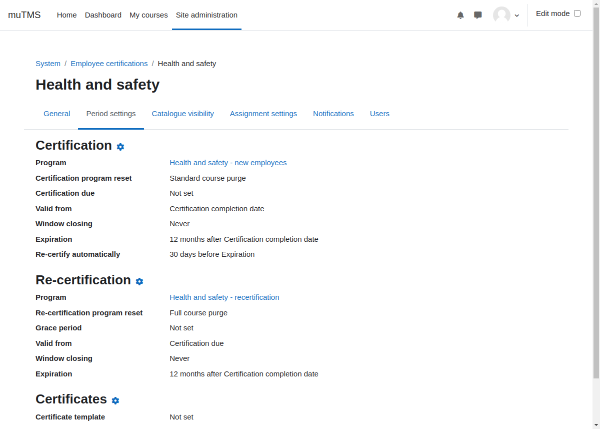

[Certifications documentation](index.md) / [Certification management](management_index.md) / Period settings

# Period settings

Certification period refers to the duration for which a certification remains valid. Administrators can
define this validity period when creating a certification program. Once the certification expires, users may
need to recertify by completing the necessary requirements again.

Each certification period includes a certification window, which specifies the following:
- **Window opening date**: When the program becomes available to the user.
- **Certification due date**: The expected date for program completion.
- **Window closing date**: When the program closes, even if not completed.

Valid periods have the following key dates:
- **Valid from date**: The starting date when the certification is considered valid.
- **Expiration date**: The date when the certification becomes invalid.
- **Re-certification date**: An optional date indicating when re-certification becomes available.

Window dates are calculated during the creation of a new certification period. Expiration and renewal dates are
usually determined at the time when certification period is completed.

