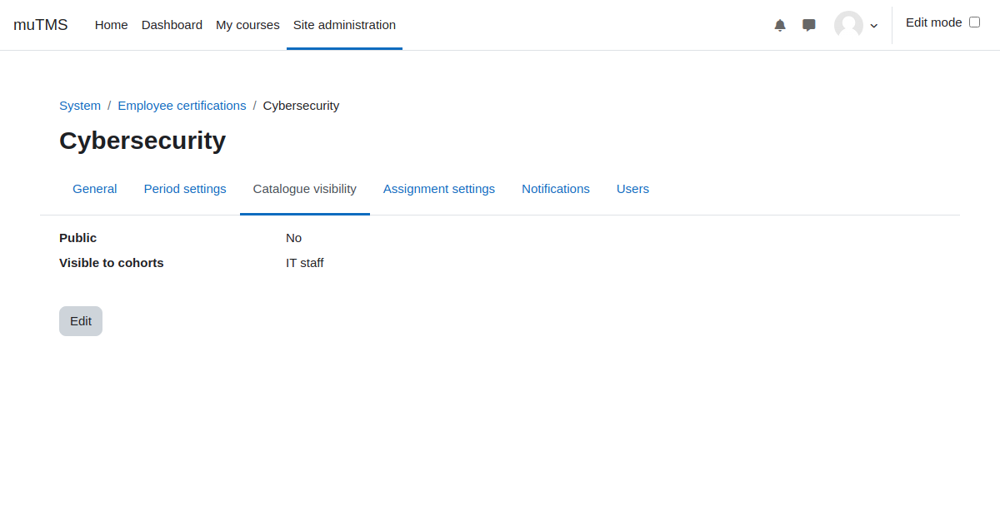

[Certifications documentation](index.md) / [Certification management](management_index.md) / Catalogue visibility

# Catalogue visibility

Certification visibility in the catalogue is not influenced by roles, capabilities, or contexts. Instead,
visibility can be restricted through cohort membership or made publicly accessible to all users.

Archived certifications are never visible in the certification catalogue.

Students can use the certification catalogue to explore available certifications.
Some certifications may allow users to sign up directly through the catalogue.

Certification visibility in the catalogue is managed through these settings:
- **Public flag**: When set to "Yes," all site users can view the certification in the catalogue. If
  multitenancy is active, tenant separation is strictly enforced.
- **Visible to cohorts**: Only members of specified cohorts can view the certification in the catalogue.

Regardless of these visibility settings, users can see all certifications assigned to them in the
certification catalogue.

The _My Certifications_ profile page and block display all certifications assigned to users, irrespective of
visibility settings, unless the certification or assignment is marked as archived.

The certification management interface uses the capability _View certifications management_, which is
specific to the certification context and not intended for student roles.

During the certification window, certification programs are visible in the _My programs_ profile page and
dashboard block.
