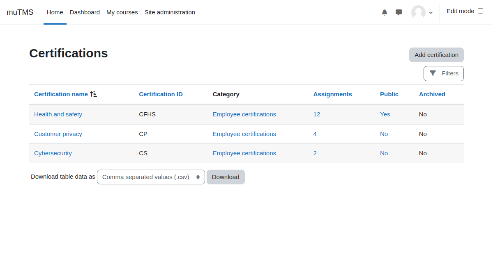

[Certifications documentation](index.md) / Certification management

# Certification management

* [Certification settings](management_certification.md)
* [Period settings](management_certification_settings.md)
* [Catalogue visibility](management_certification_visibility.md)
* [Certification assignment settings](management_certification_assignment.md)
* [Certification users](management_certification_users.md)
   * [User assignment](management_assignment.md) 

Certification can be created at either the system or course category context levels. Access to the certification management
interface is, by default, limited to users with Manager or Editing teacher roles.

## Accessing Certification management

Certification management interface is very similar to program management interface.

* **Site Managers** can reach the certification management interface via: **Site administration > Certifications > Certification management**
* Users with the **View certification management** capability in system context may use an alternative route:
    * Click on the **Certification catalogue** link located within the My certifications profile page or dashboard block.
    * Then, press **Certification management** button.
* Users with **View certification management** capability in a specific category only can use a workaround:
    * Navigate to the relevant course category management or browsing page.
    * Click **Certifications** link in the secondary navigation menu.

## Overview of management capabilities

Certification management capabilities define the level of access and permissions for different operations.
Below are the key capabilities:

| **Capability**                        | **Description**                                                                                               |
|---------------------------------------|---------------------------------------------------------------------------------------------------------------|
| View certification management         | Browse certifications at the system or course category level, view certification details, and assigned users. |
| Add and update certifications         | Create new certifications and modify the settings of existing ones.                                           |
| Delete certifications                 | Delete certifications, periods and related user data.                                                         |
| Assign users to certifications        | Assign users manually and restore assignment. Depends on assignment source logic.                             |
| Unassign users from certifications    | Manually unassign users and archive assignments. Depends on assignment source logic.                          |
| Configure certification custom fields | System level capability, configure certification custom fields.                                               | 
| Advanced certification administration | Carry out specialized, high-risk operations related to certifications and assignments.                        |
