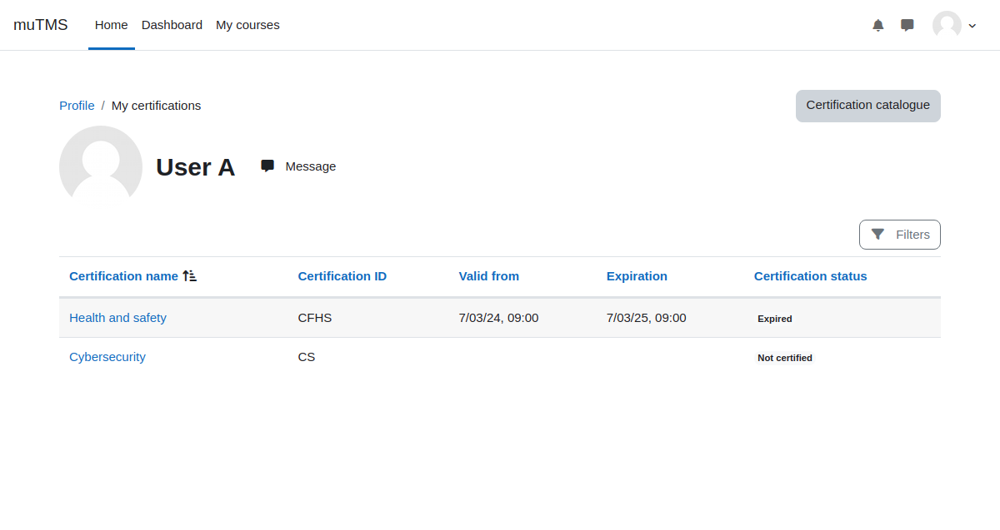
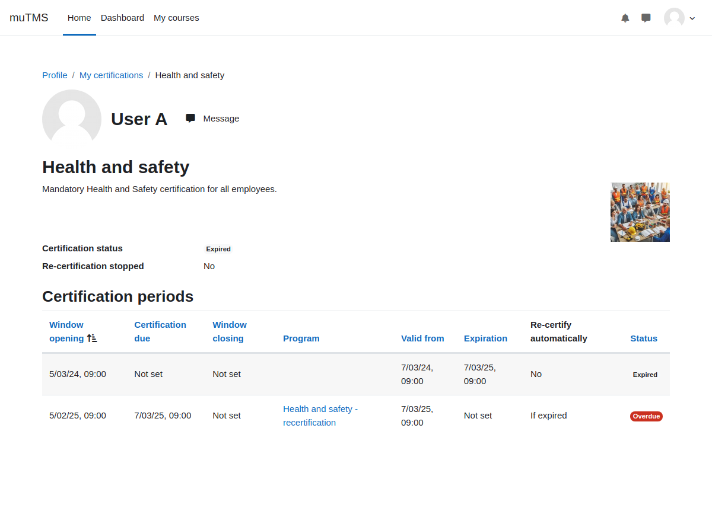

[Certifications documentation](index.md) / My certifications page

# My certifications page

The _My Certifications_ page on the profile allows users to view all certifications they are assigned to.
Certifications will not appear if their assignment or the certification itself is marked as archived.

Users can access certification details and status by clicking on the respective certification links.

